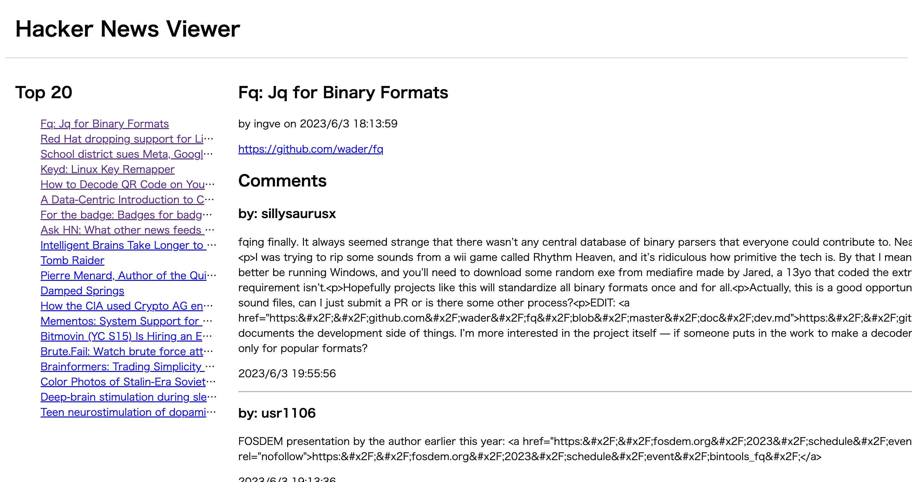

# remix-first-web-site
First web site with Remix.

## Start the dev server
```bash
cd hackernews-viewer/
npm run dev
```



## Referenced sites
- [Remixを触る上できちんと知っておきたい機能「Nested Routes」を解説](https://codezine.jp/article/corner/942)
